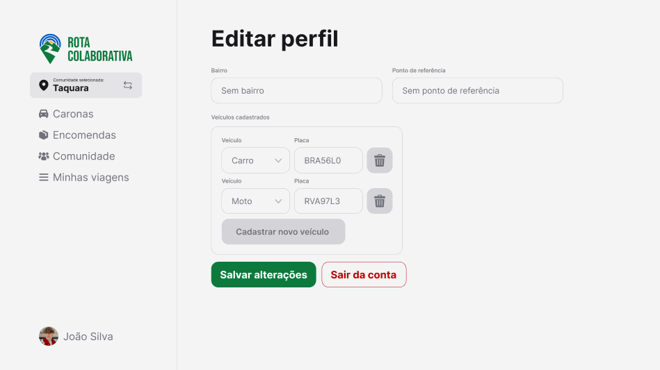

# Projeto de Interface

As telas do nosso protótipo foram desenvolvidas para serem simples e intuitivas, visando atender pessoas com diferentes níveis de familiaridade com a tecnologia — uma característica identificada em nosso público-alvo durante as entrevistas.

Além disso, a interface inclui funcionalidades pensadas para suprir as necessidades de transporte de moradores de áreas afastadas dos centros urbanos. Entre os recursos disponíveis estão: solicitação de caronas, envio de encomendas, chat entre usuários, sistema de avaliação e acesso a páginas da comunidade local, como comércios e outros serviços da região.

## User Flow

## Wireframes

Na tela inicial o usuário tem a opção de criar uma conta ou fazer o login.

Para criar uma conta, o usuário deverá informar seus dados pessoais como nome, e-mail, telefone, comunidade à qual pertence e endereço. Também será necessário escolher uma senha, definir um nome de usuário e, se tiver interesse em oferecer caronas ou transportar encomendas, cadastrar as informações do seu veículo.

Na tela de login, o usuário deverá utilizar o nome de usuário e senha.

Na tela de caronas, o usuário poderá oferecer ou pedir uma carona.

Para oferecer uma carona, o usuário deverá informar o local de partida e de destino, a data da viagem, o horário de saída e a quantidade de vagas disponíveis. Também deverá selecionar o veículo que será utilizado, indicar se haverá custos, marcar se está disponível para transportar encomendas e, opcionalmente, informar uma previsão de retorno.

Após criada a oferta de carona, é perimitdo que o usuário edite os dados se necessário.

Para solicitar uma carona, o usuário deverá informar o local de partida e de destino, a data da viagem e o horário de saída. Também deverá informar se precisará de carona para a voltar e se sim, informar a data e horário do retorno. Nesta mesma tela, é possível marcar se esta solicitação se trata de uma emergência.

Após criado o pedido de carona, é perimitdo que o usuário edite os dados se necessário.

Na tela de encomendas, o usuário poderá escolher entre se disponibilizar para transportar uma encomenda ou solicitar que outra pessoa realize o transporte.

Para oferecer o transporte de encomendas, o usuário deverá informar o local de partida e de destino, a data da viagem e o horário de saída. Também deverá selecionar o veículo que será utilizado, indicar se haverá custos, e opcionalmente, informar uma previsão de retorno.

Após criada a oferta de trasnporte de encomendas, é perimitdo que o usuário edite os dados se necessário.

Para solicitar o transporte de encomendas, o usuário deverá fornecer uma descrição do item, o local de coleta e o local de entrega. Também será necessário informar se o destinatário é ele próprio ou outra pessoa e, neste caso, indicar o nome do destinatário, além da data e do horário previstos para o recebimento.

Após criada a solicitação de transporte de encomendas, é perimitdo que o usuário edite os dados se necessário.

Na tela das comuidades é possível encontrar os comércios ou locais que prestam serviços na região, também pode ser utilziado o filtro por comunidades.

A página do local exibe as ofertas e solicitações de caronas ou transportes que saem ou partem daquele local específico.

Caso o usuário seja um comerciante ou prestador de serviços e possua um local para cadastrar na plataforma, ele poderá informar o nome do estabelecimento, a comunidade à qual pertence, a categoria do serviço, inserir uma foto de capa para a página do local e o endereço.

O usuário terá acesso ao histórico de viagens, incluindo tanto as ofertas quanto as solicitações de caronas e transporte de encomendas.

No perfil do usuário, é possível visualizar a foto, a quantidade de viagens realizadas, a avaliação recebida de outros usuários, a localização e um breve texto de biografia.

O usuário consegue editar as informações do perfil.

É possível realizar o cancelamento de uma oferta ou solicitação inserindo uma justificativa.

