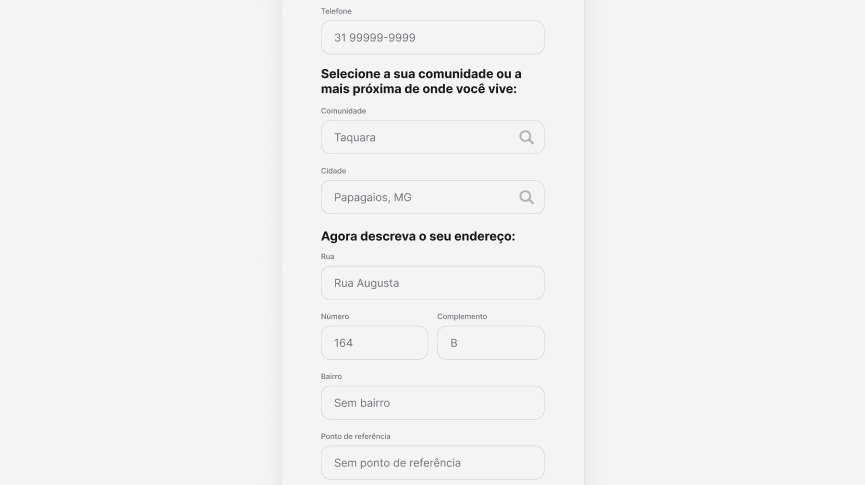

# Projeto de Interface

As telas do nosso protótipo foram desenvolvidas para serem simples e intuitivas, visando atender pessoas com diferentes níveis de familiaridade com a tecnologia — uma característica identificada em nosso público-alvo durante as entrevistas.

Além disso, a interface inclui funcionalidades pensadas para suprir as necessidades de transporte de moradores de áreas afastadas dos centros urbanos. Entre os recursos disponíveis estão: solicitação de caronas, envio de encomendas, chat entre usuários, sistema de avaliação e acesso a páginas da comunidade local, como comércios e outros serviços da região.

## User Flow

## Wireframes

Na tela inicial o usuário tem a opção de criar uma conta ou fazer o login.

