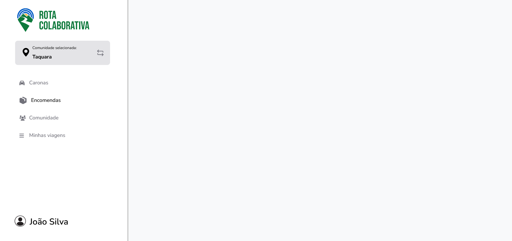

# Template padrão do site

Este documento apresenta o layout padrão e os guias de estilo utilizados no projeto do site Rota+, incluindo identidade visual, responsividade, iconografia, tipografia e padrões de componentes.

## Design

O sistema utiliza um layout dividido em duas partes principais:

Sidebar fixa (`<aside class="sidebar">`) à esquerda ocupando 25% da largura da tela (desktop).

Área principal de conteúdo (`<main class="main-content">`) à direita, que ocupa os 75% restantes.

O logo é carregado dinamicamente via JavaScript no topo da sidebar:
``

Menus padrões:

Caronas:
Ícone: `<i class="fa fa-car"></i>`

Encomendas:
Ícone: imagem SVG: /assets/images/encomendas.svg

Comunidade:
Ícone: `<i class="fa fa-users"></i>`

Minhas viagens
Ícone: `<i class="fa fa-bars"></i>`

## Cores

| Categoria                  | Cor principal     | Código Hex                      |
| -------------------------- | ----------------- | ------------------------------- |
| **Fundo geral**            | Cinza muito claro | `#f8f9fa`                       |
| **Texto secundário**       | Cinza escuro      | `#6b7280` / `#71717a`           |
| **Borda lateral**          | Cinza médio       | `rgb(201, 201, 201)`            |
| **Botões e cards** | Verde claro       | `#A2E9C1`, `#10b981`, `#065f46` |
|                            | Azul claro        | `#dbeafe`, `#3b82f6`, `#1e40af` |
|                            | Laranja claro     | `#fed7aa`, `#f97316`, `#c2410c` |

## Tipografia

| Uso                 | Classe CSS       | Tamanho        | Peso   |
| ------------------- | ---------------- | -------------- | ------ |
| Subtítulo/descrição | `.card-subtitle` | 1.25rem        | 600    |
| Título de Card      | `.card-title`    | 1rem           | 500    |
| Rodapé de Card      | `.card-footer`   | 0.95rem        | normal |
| Texto do menu       | `.nav-link`      | 1.2rem         | 500    |
| Nome do usuário     | `.user-name`     | 2rem (desktop) | 600    |

## Iconografia

Bibliotecas usadas:

Font Awesome:
Incluída via CDN – usada nos menus e botões (`.fa, ex: .fa-car, .fa-users`)

Bootstrap Icons:
Ex: `bi bi-geo-alt-fill`

Ícones personalizados:
Imagens SVG como `repeat.svg` e `encomendas.svg`

Estilização:

Tamanho e cor definidos inline ou em CSS:

`.nav-link i → font-size: 1.2rem; width: 20px;`

`.card-footer i → color: #9ca3af;`

Ícones nos botões e menus possuem espaçamento com gap

Estilos CSS Criados para Elementos:

Sidebar:

`.sidebar, .sidebar-container, .sidebar-nav, .nav-list, .nav-link, .nav-item`

Responsiva, com transições suaves e estilo fixo em desktop

Cards:

`.viagem-card, .card-title, .card-subtitle, .card-footer, .btn-info`

Tem variações por cor: `.cor-green, .cor-blue, .cor-orange`

Botões:

`.btn-info: estilizado por cor do card, com hover, gap, padding e box-shadow`

Perfil de Usuário:

`.user-profile, .user-avatar, .user-name`

Posicionado na parte inferior da sidebar

